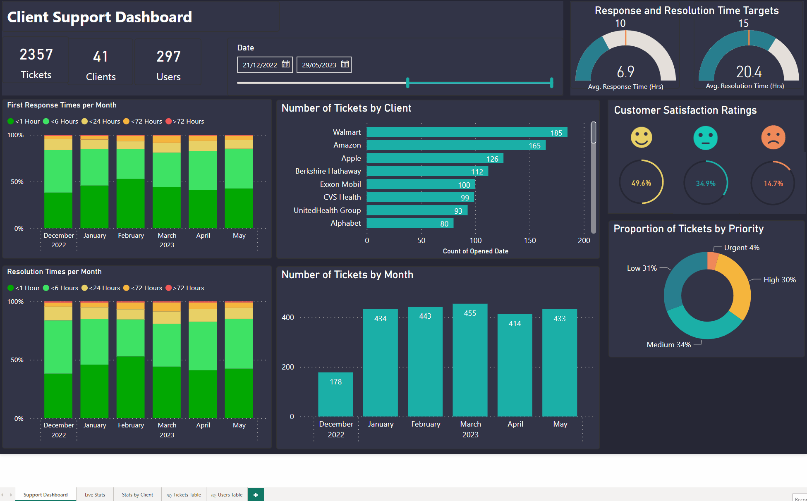
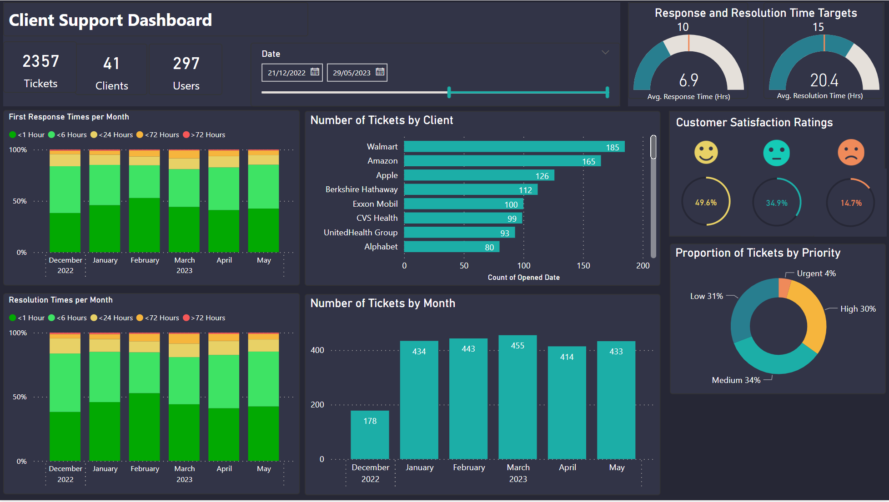
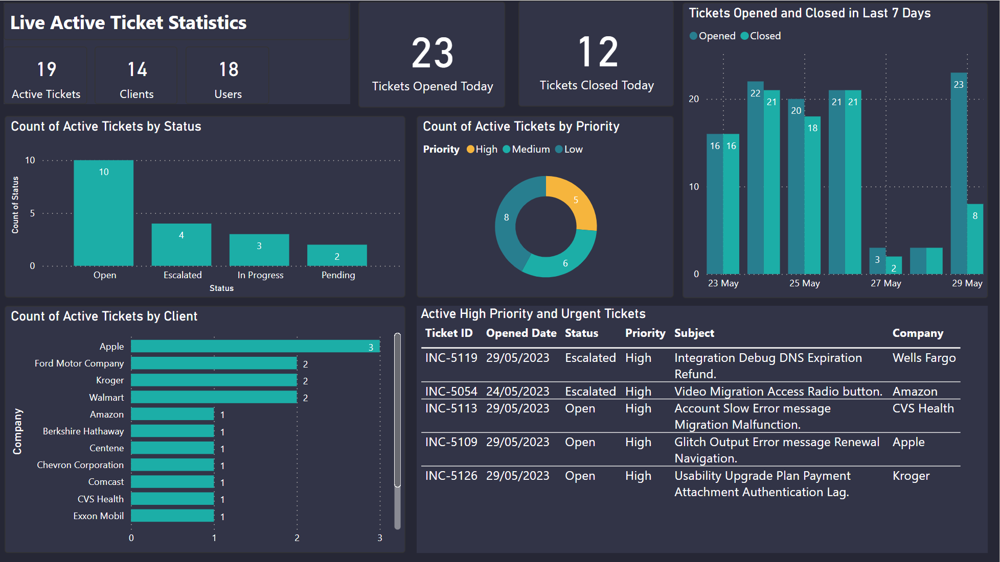
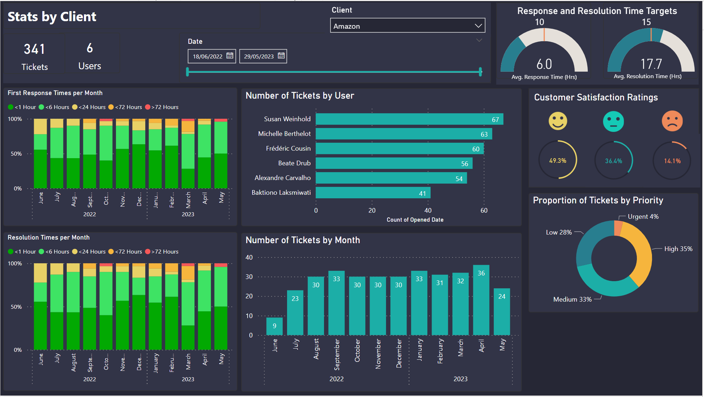

# Support-Ticket_KPIs
This project is largely based on a PowerBi report that I built in my current role. 

The PowerBi report is used by the Client Support team to monitor and track monthly KPIs on ticket requests from users. It also allows the team to view live ticket statistics and quickly search for client specific information.




## Tools and Libraries Used 
- Webscraping was done using Python (Pandas)
- Data generation and manipulation was done using Python (Pandas, Numpy, Faker)
- Reporting / Dashboarding was done using PowerBI and DAX

## Narrative
FakeCompany Plc is an SaaS B2B company that provides ground-breaking analysis of their client's sales data to help guide the client's business decisions and ultimately drive success. The clients are made up of top worldwide companies, such as Amazon, Alphabet and Apple. 

FakeCompany Plc's Client Support team acts as the first line of support for clients to contact when they have issues. Due to the large annual subscription fee that each client pays, the client's users expect top-notch, fast and whenever they contact the Client Support team. As such, it is incredibly important that the Client Support team manage and track key KPIs to ensure that they maintain the level of service expected of them. 

The Client Support team uses a 3rd party service called FreshService to manage, track and respond to incoming ticket requests from clients. Using FreshService's [REST API](https://api.freshservice.com/), the team can fetch key data about all historical tickets received/handled by the team. The report below is built on data obtained from the REST API. 

## The PowerBI Report 
The report consists of 3 pages:

### 1. Support Dashboard




This page allows users to view summary data abut the Client Support tickets, as well as high priority KPIs such as:  
- Resolution times 
- Response times
- Customer satsifcation etc)

**Features:**
- Date slider to select KPI date range (e.g Annual, Monthly etc).
- Hover over graphs to see ticket information. 
- Gauges to track average resolution/response times and their targets.

### 2. Live Stats



This page allows users to view a summary of all currently active tickets.

**Features:**

- Live count of active tickets and their priority/status.
- Table highlighting current 'High' and 'Urgent' priority tickets.
- Hover over graphs to see ticket information. 

### 3. Stats By Client



This page allows users to view summary data abut the Client Support tickets specific to individual clients. 

**Features:**
- Date slider to select date range.
- Slider to select specific company/client. 
- Hover over graphs to see ticket information. 

## Generating the data

- Firstly, we need to generate a list of fake clients for FakeCompany Plc. This is done using the Python script ```scraper.py``` to scrape a list of the top 100 companies in the US from this Wikipedia article: [https://en.wikipedia.org/wiki/List\_of\_largest\_companies\_in\_the\_United\_States\_by\_revenue](https://en.wikipedia.org/wiki/List_of_largest_companies_in_the_United_States_by_revenue).

- For each company in the list, I then generated a list of fake 'users' that may contact Fake Company Plc's Client Support Team. This is done using the Python script ```generate_users.py```, which uses the [Faker](https://faker.readthedocs.io/en/master/) library to generate fake, localized names of the users.

- Then, the dataset of fake tickets is generated using the Python Script ```generate_tickets.py```. For each date, a random number of tickets is created. 
  - There are 5 variables that can be configured before generating the data:
    - ```start_date``` - The start day of the ticket data.
    - ```end_date``` - The final day of the ticket data. (No tickets will be generated after this date)
    - ```avg_daily_tickets``` - The number of tickets to be generated each day on average. 
    - ```weekend_multiplier``` - Reduce the number of tickets generated on Saturday and Sunday. E.g 0.1 means 10% of the normal ticket count will be generated on weekends. 

- Each ticket is generated with the following information: 
  - ```User ID ``` - The ID of the user that sent the ticket.
  - ```Ticket ID ``` - The Ticket ID.
  - ```Opened Date``` - The date/time that the ticket is created.
  - ```Priority``` - The (Low/Medium/High/Urgent)
  - ```First Response Time``` - How long it took the Client Support team to send their initial response to the user (Blank if not yet responded). 
  - ```First Response Date``` - The date that the Client Support team sent their initial response to the user (Blank if not yet responded). 
  - ```Resolution Time``` - How long it took the Client Support team to close the ticket (Blank if not yet closed). 
  - ```Resolved Date``` - The date that the Client Support team closed the ticket (Blank if not yet closed). 
  - ```Status``` - The status of the ticket:
      - 1. Open - Not yet reviewed by the team.
      - 2. In progress - Currently being worked on by the team.
      - 3. Pending - Awaiting further information from the user. 
      - 4. Escalated - Escalated internally to the next level of support. 
  - ```Subject``` - The Subject of the initial ticket email. 
  - ```Happiness Rating``` - The rating feedback given by the user (Unhappy, Neutral, Happy) (Blank if ticket not yet closed). 


## Usage

- Install requirements using ```pip install -r requirements.txt```
  - Ensure you use Python 3
- Run ```scraper.py```
  - This will scrape and download the company data from Wikipedia
- Run ```generate_users.py```
  - This will generate a list of fake support requesters 
 - Run ```generate_tickets.py```
  - This will generate the fake ticket data for the report
- Read the generated```02_users.csv``` and ```03_tickets.csv``` into the PowerBI report ```Support_Ticket_KPIs.pbix``` by changing the source path

## Future Improvements

- Add regional email address domains. Currently all fake emails of users end in '.com'.
- Change so that users are more likely to send emails during the working day for their timezone. 

